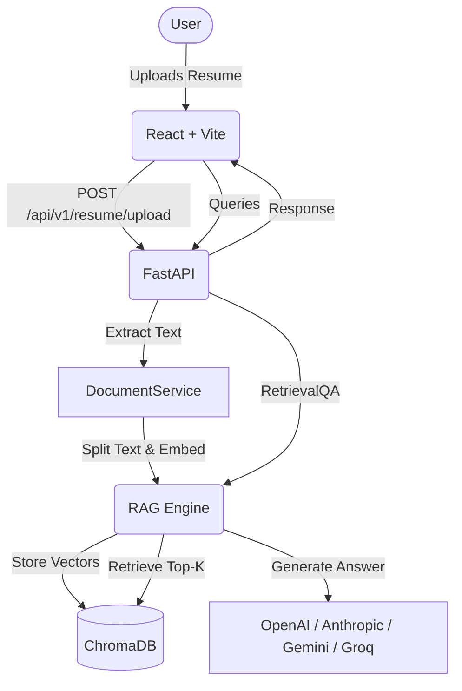

# CareerPilot AI 🚀

An elite, production-ready AI Resume Analysis and Career Assistant platform. CareerPilot AI deeply analyzes resumes, scores them against ATS standards, and features a multi-LLM Retrieval-Augmented Generation (RAG) chat interface to act as your personal career coach.

## Features
- **Document Parsing**: Upload PDF, DOCX, and TXT resumes.
- **RAG Engine**: Powered by LangChain, ChromaDB, and Sentence Transformers for precise contextual retrieval.
- **AI Career Coach**: Interactive chat interface with streaming responses, markdown support, and context memory.
- **Multi-LLM Support**: Seamlessly switch between OpenAI (GPT-4o), Anthropic (Claude 3), Google (Gemini 1.5), and Groq (Llama 3).
- **Resume Scoring**: Generates detailed ATS, readability, and technical skill scores presented on beautiful radar and bar charts (via Recharts).
- **Security**: JWT Authentication and protected API routes.

## Architecture Diagram


## Tech Stack
- **Frontend**: React 18, TypeScript, TailwindCSS, Shadcn UI, Recharts, Framer Motion, Axios.
- **Backend**: FastAPI, SQLAlchemy, Pydantic, Passlib, JWT.
- **AI/ML**: LangChain, ChromaDB, Sentence-Transformers, PyMuPDF.
- **Infrastructure**: Docker & Docker Compose.

## Installation & Deployment

### Environment Setup
Create a `.env` file in the `backend/` directory:
```env
OPENROUTER_API_KEY=your_openrouter_key
GEMINI_API_KEY=your_gemini_key
SECRET_KEY=supersecretkey_change_in_production
DATABASE_URL=sqlite:///./sql_app.db
CHROMA_DB_DIR=./chroma_db
```

### Run with Docker (Recommended)
You can launch the entire application stack using Docker Compose:
```bash
docker-compose up --build
```
- Frontend will be available at: `http://localhost:5173`
- Backend API will be available at: `http://localhost:8000`
- Interactive API Swagger Docs: `http://localhost:8000/docs`

### Future Improvements
1. **Cloud Vector Stores**: Migrate from local ChromaDB to Pinecone or Qdrant for horizontal scalability.
2. **PostgreSQL**: Switch the SQLite database to PostgreSQL using the provided SQLAlchemy configuration.
3. **Advanced Parsing**: Use specialized NER models to better extract unstructured entities from complex PDF layouts.

## License
MIT License
